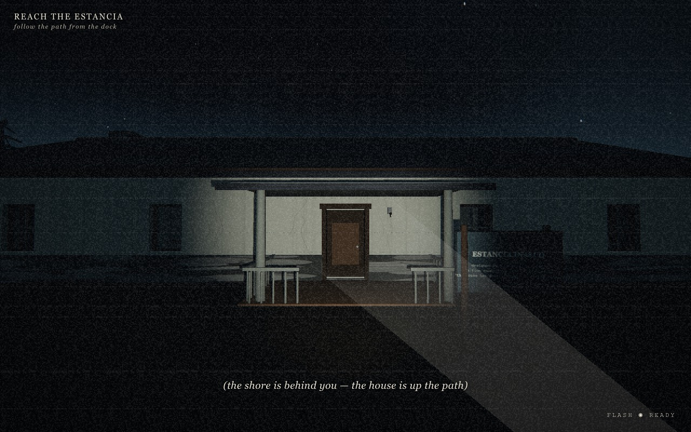
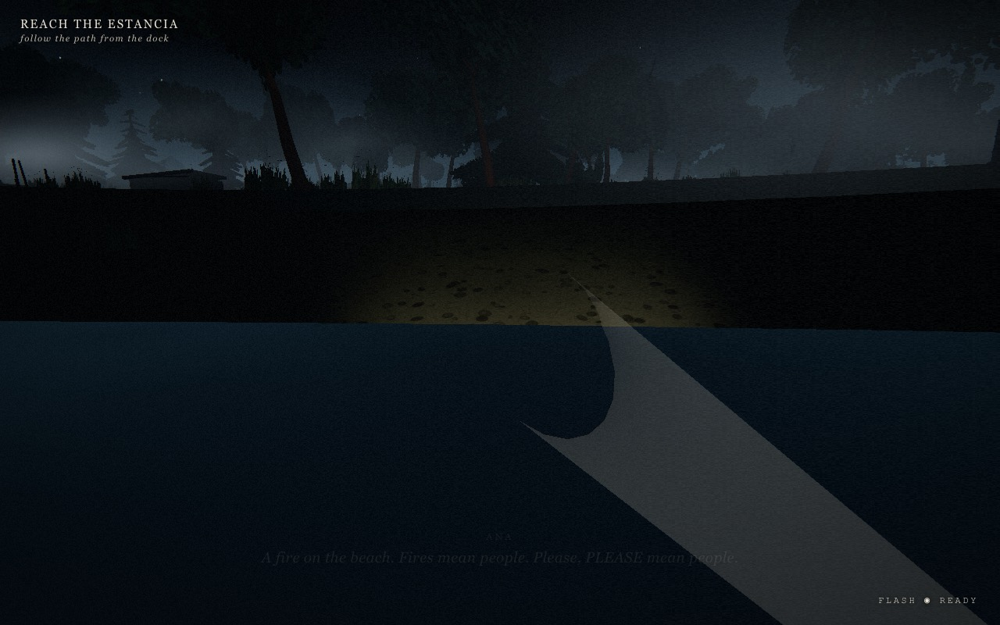
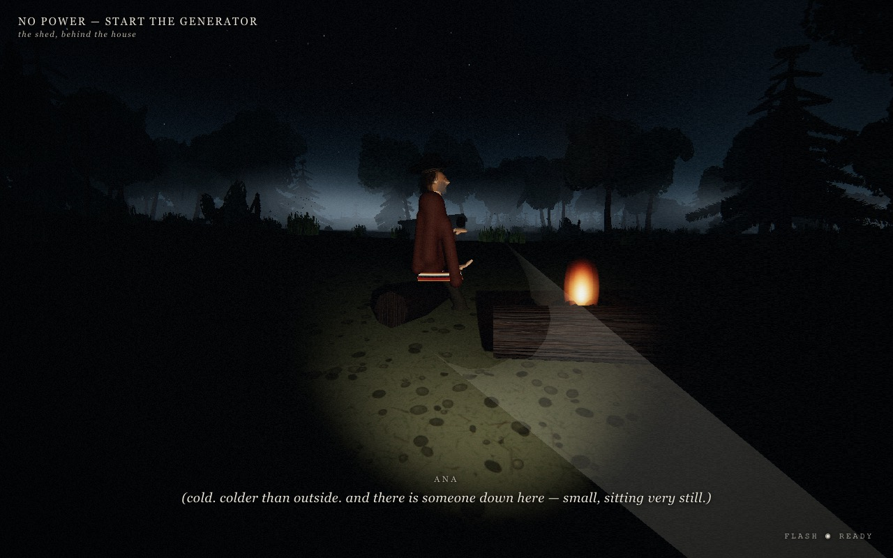
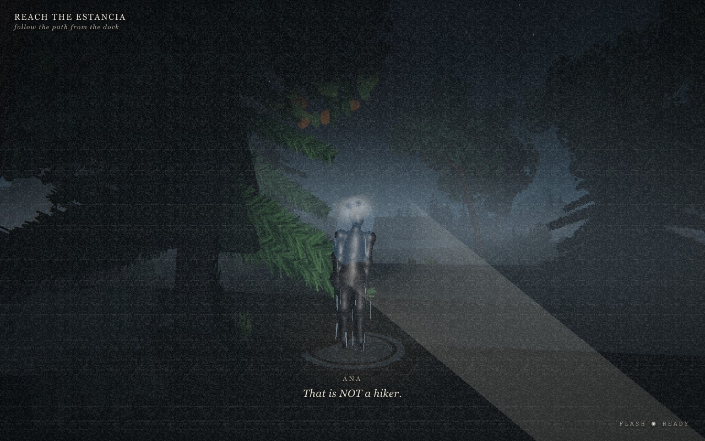
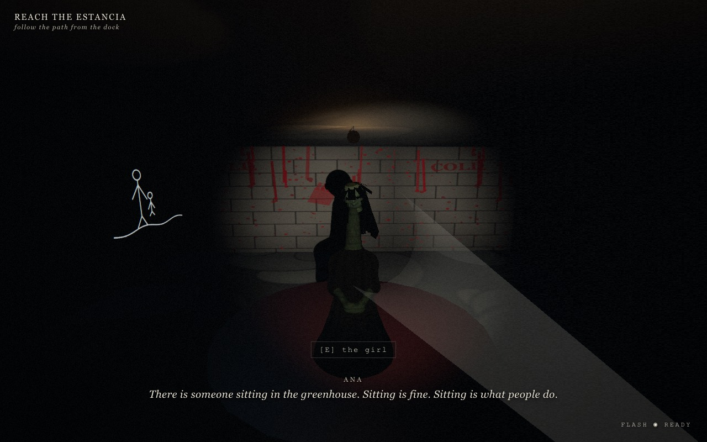
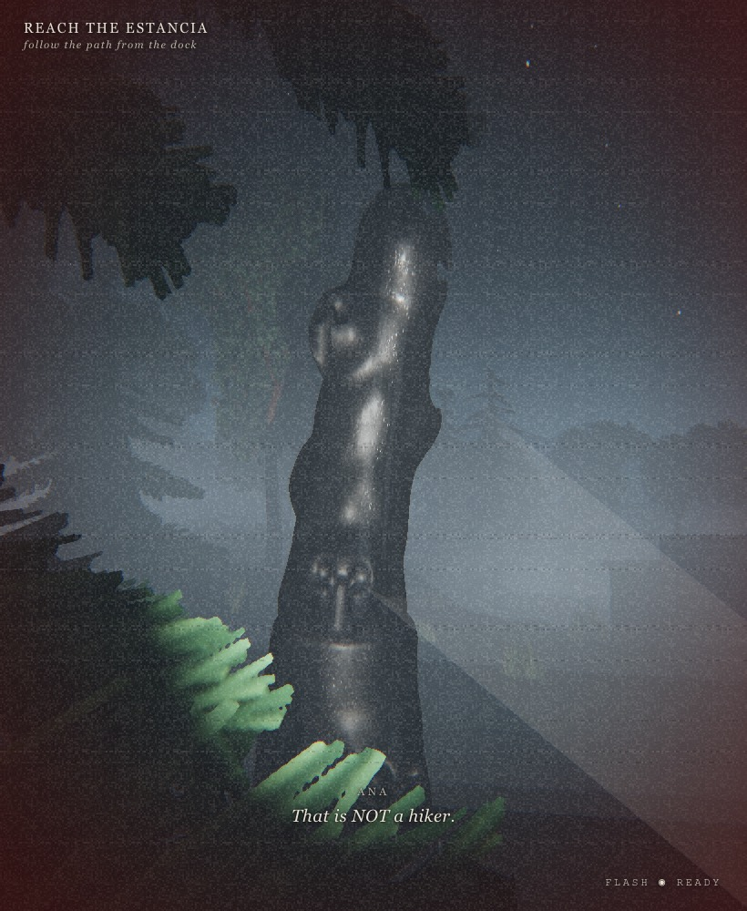
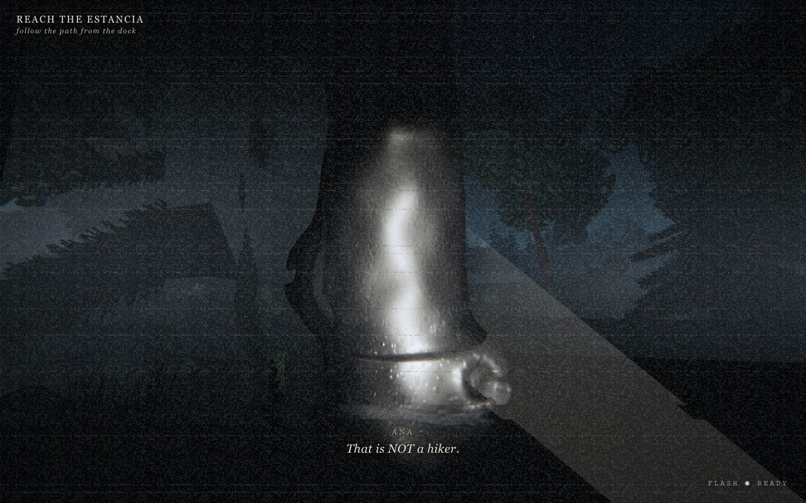

# INALCO

### *The lake gives back what it takes.*

> A first-person survival-horror game. One foggy night on a Patagonian lake, a
> photographer, and a camera whose flash is the only thing the dead are afraid of.



---

## The pitch

Your sister went into the water off Inalco point nine days ago. Two days later,
she walked back out.

You are **Ana Reyes**, a photographer who missed the last ferry home. Between
you and morning there is a dark house, a dying generator, a chained boat, and
the **Returned** — the drowned, walking back out of the lake, rebuilt from the
imperfect memories of everyone who still grieves them. They are blurry where
memory is blurry. Smooth where nobody ever really looked.

You cannot fight them. You have one weapon: **your camera flash.** A photograph
is a memory that *can't* blur. Show a Returned an exact record of what it really
is, and the copy loses the argument with itself.

Survive until first light. Find out what happened to Lucía. Decide how much of
the truth you can carry back across the water.

**Never answer when it calls your name. It gets the name right. It gets the
voice right. It's the *inside* it can't do.**

---

## Screenshots

| | |
|---|---|
|  |  |
|  |  |

<p align="center">
  
  
</p>

---

## Features

- 🩶 **A weapon that isn't a weapon.** No guns. No melee. Your camera's flash is
  your only defense — one flash staggers a Returned, two disprove it. Six seconds
  to recharge, and every shot lights up exactly how close it got.
- 🌫️ **Enemies that break the rules of looking.** *The Half-Seen* freezes the
  instant you watch it — then lunges anyway. *The Draft* only moves when it's
  off-camera. *The Congregation* doesn't chase; it stands over what you need and
  waits to be recognized.
- 🕯️ **A living night, not a level.** A fog-tide rises and falls across one real
  night. The longer you're out, the bolder they get — and the closer dawn comes.
  Fire and lamplight are shelter. The dark is not.
- 📻 **Read the static.** No health bar theatrics — you listen. Radio hiss, the
  silence where the crickets should be, a voice at the waterline that knows your
  name. The game tells you you're not alone before you can see why.
- 🗺️ **A place worth searching.** An abandoned lakeside estancia, a maze of rooms,
  a flooded boathouse, a greenhouse, a crew camp still recording, a cellar, and a
  grave the garden grew over. Unmarked discoveries reward the curious.
- 🎞️ **Photograph the truth.** Some things only appear in the developed photo.
  Aim, flash, and check what the frame caught that your eyes didn't.
- 👥 **Three survivors, real choices.** Talk to the fire-keeper, the last of the
  film crew, and the gardener who's kept this shore for eighty years. What you
  promise — and who you save — rewrites the ending.
- 🎬 **Six pieces of proof, two endings.** Assemble enough and Ana *knows* what
  the lake does. Assemble too little and she only *hopes* — and hope is what the
  lake uses.
- 🎨 **100% procedural, zero downloaded art.** Every wave, tree, face, and monster
  is generated in code (Three.js + WebAudio). Runs in the browser. No install.

---

## The Returned

Three things come out of the water. Each one breaks a different rule of horror.

> **THE HALF-SEEN** — rebuilt from a single glimpse of someone nobody ever really
> looked at. Mostly posture and wet hair. Being watched *pins* it — observation
> is the only detail it has — until the pressure builds and it lunges anyway.
> *"FRAME 01 — it held still for the flash. Subjects do not do that."*

> **THE DRAFT** — not one of the dead. A practice copy of the *living*, made from
> what the lake has already read out of you. It can't do "being watched" yet — so
> it only moves when you look away.
> *"FRAME 02 — it was closer in this photo than it was when I took it."*

> **THE CONGREGATION** — the oldest Returned, remade so many times across eighty
> years it's a composite of everyone's dead. It doesn't chase. It stands near
> what you need and waits to be recognized. By anyone.
> *"FRAME 03 — I count too many hands. All of them are folded. It is being patient."*

---

## Setting

Lake Nahuel Huapi, Patagonia, off a point called Inalco. Glacier-cut, cold, and
very deep. Something old lives in the deep water. It is **not malicious.** It
*collects* — it keeps what drowns. And it is generous in the way of things that
don't understand people: **it gives back.**

It has never seen a living person, only remembered ones. So it rebuilds the dead
from the memories of those who grieve them. Memory is imperfect. What comes back
is wrong.

The locals have an arrangement, eighty years old: shore fires on fog nights, salt
at the thresholds, no burials within sound of the water — and *no one answers the
lake.* You arrived tonight not knowing the rules. The film crew before you didn't
know them either.

---

## Controls

| Input | Action |
|---|---|
| **WASD** / arrows | Move |
| **Mouse** | Look |
| **Shift** | Run (limited stamina) |
| **E** | Interact / read / hold to work the generator |
| **F** | Flashlight (on by default) |
| **Left click** | Camera flash — staggers the Returned (6 s recharge) |
| **1–3** | Dialogue choices |
| **Esc** | Pause / journal |

**Headphones strongly recommended.** The audio *is* the warning system.

---

## Play it

The game runs entirely in the browser — nothing to install for the player.

```bash
npm install
npm run dev
```

Then open the printed local URL (usually `http://localhost:5173`).

*Built with Three.js + WebAudio. Fully procedural — no downloaded assets. Autosaves
as you go; a Continue option appears when a save exists.*

---

## Tips for surviving the night

- One flash **staggers** a Returned. **Two disprove it.** Make the second count.
- Break line of sight — or kill your flashlight and keep still — and they lose you.
  Then they search where they *last saw* you.
- The house and the campfire are shelter. Stay in the light and they'll circle,
  lose conviction, and drift away.
- The Draft only moves when you aren't looking at it. So don't look away.
- When the water calls your name, **keep walking.**

---

<p align="center"><em>Inalco. Last house on the lake. Don't wait on the dock after dark.</em></p>
